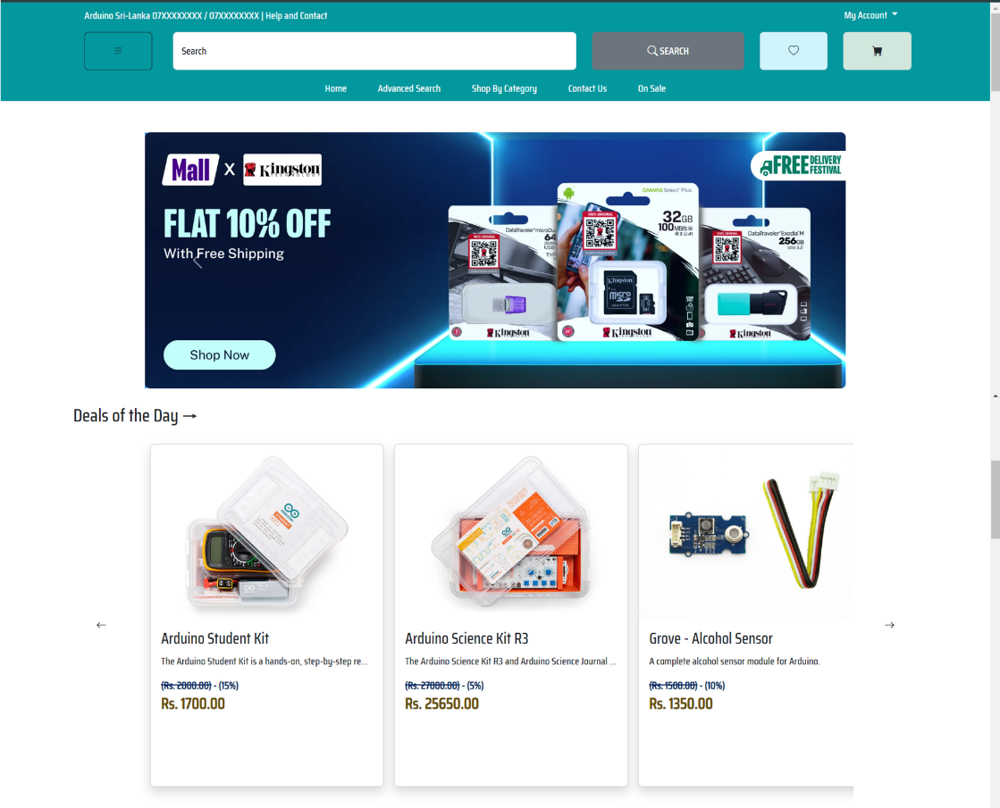
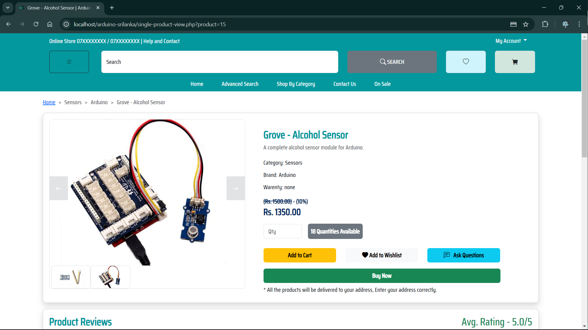
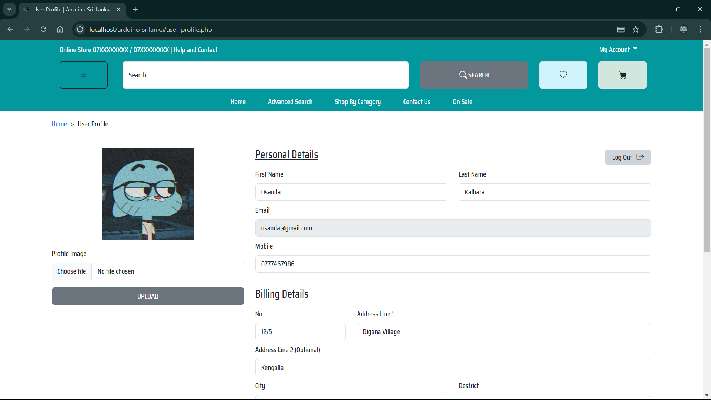
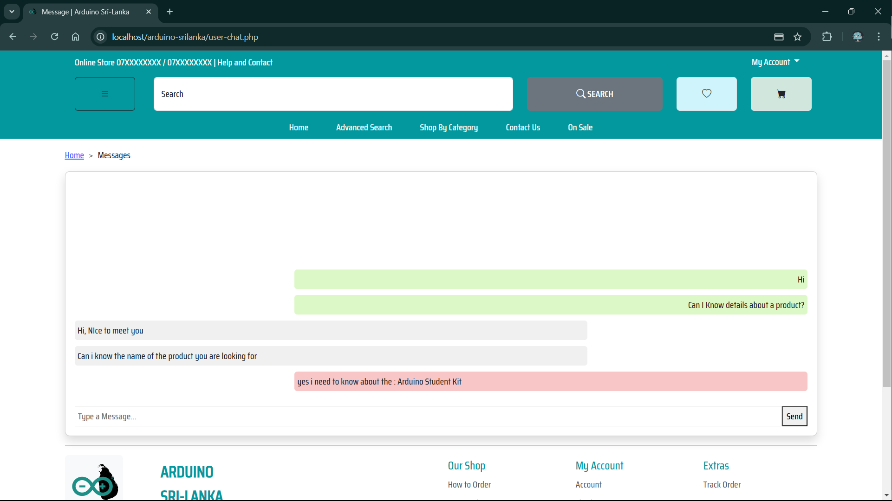
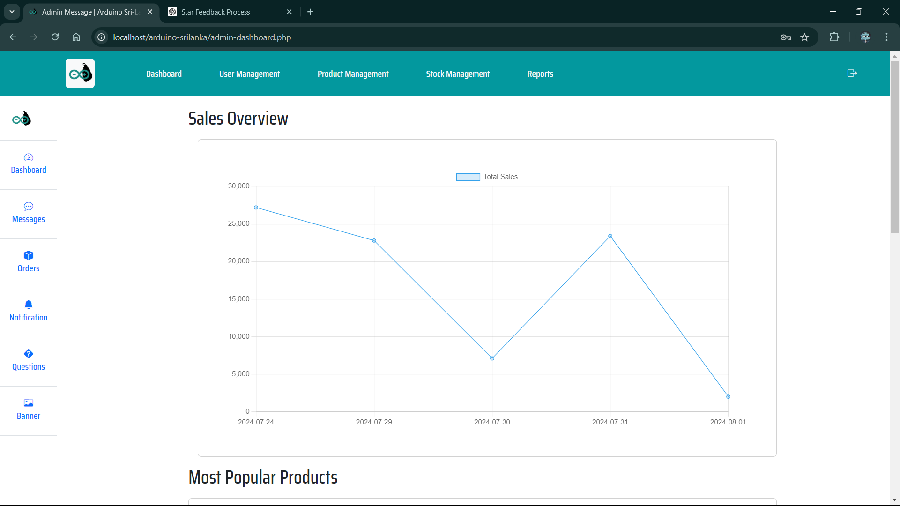
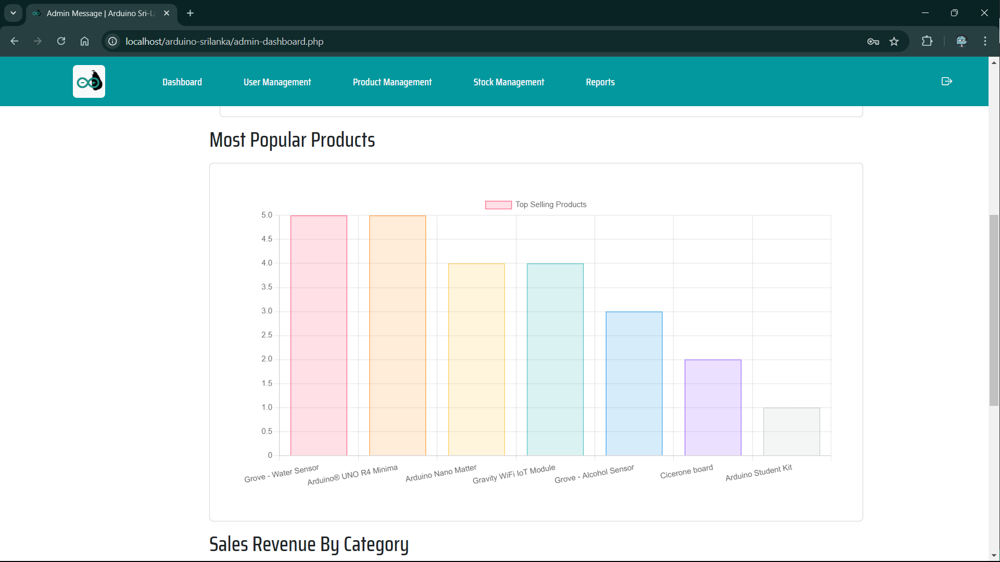
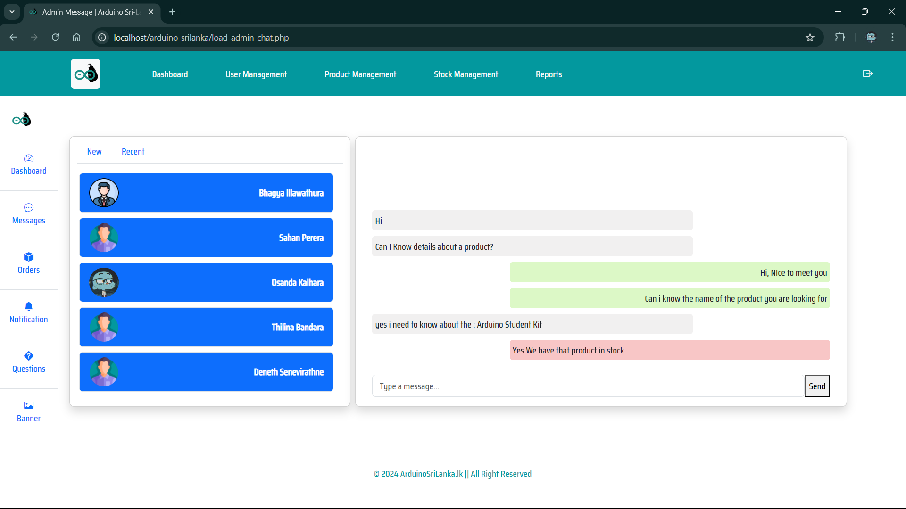
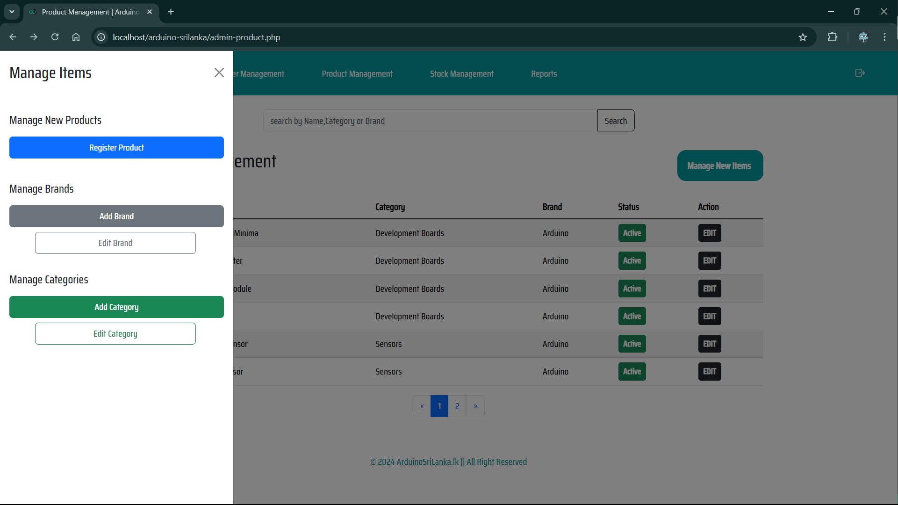
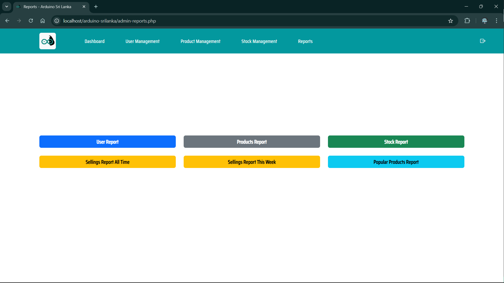

# Arduino Sri Lanka E-Commerce Website

This is a full-stack web application built with **HTML, CSS, JS, PHP, and MySQL**.  
The purpose of this e-commerce web application project is to create a robust and user-friendly online 
platform dedicated to selling Arduino components and related accessories. The platform aims to serve 
both hobbyists and professionals in the electronics community by providing easy access to a wide range 
of high-quality Arduino products.

The project is designed to offer a seamless shopping experience for users, featuring an intuitive user 
interface, advanced search capabilities, secure payment options, and personalized user profiles. Additionally, 
the platform includes a comprehensive admin interface for efficient management of products, orders, inventory, 
and customer interactions.

## ⚙️ Tech Stack
- Frontend: HTML, CSS, JavaScript  
- Backend: PHP  
- Database: MySQL  

### Homepage

### Product Page

### User Profile

### Chat

### Admin Dashboard

### Admin Chat

### Manage

### Reports

